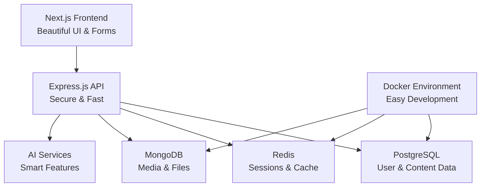

# 🤖 AI-Powered Content Management Platform

> Building the future of content management with AI integration. Currently featuring a complete authentication system with beautiful UI - and there's so much more coming!

[](https://nextjs.org/)
[](https://www.typescriptlang.org/)
[](https://nodejs.org/)
[](https://www.docker.com/)
[](https://www.prisma.io/)

## 🎯 What's Working Right Now

Just got the authentication system fully working and it looks incredible! Here's what you can actually use today:

- **🚀 Beautiful Registration & Login** - Complete with form validation and smooth animations
- **📱 Responsive Dashboard** - Clean, modern interface that works on any device  
- **🔐 Secure Authentication** - JWT tokens, password hashing, the whole nine yards
- **💾 Multi-tenant Database** - PostgreSQL with Prisma ORM, ready for organizations
- **🐳 Docker Development** - One command to get everything running locally

**Try it out:**
- Frontend: http://localhost:3000
- Backend API: http://localhost:3001
- Demo credentials: `test@example.com` / `Test123!@#`

## ✨ What Makes This Special

I'm building this as a modern, AI-powered alternative to traditional CMS platforms. The authentication system you see now is just the foundation - imagine having AI help you write better content, optimize for SEO automatically, and collaborate in real-time with your team.

### 🎨 Current Features
- **Gorgeous UI** - No more ugly forms! Everything is designed to feel smooth and professional
- **Rock-Solid Auth** - Registration, login, logout, token refresh - all working perfectly
- **Real Form Validation** - Helpful error messages that actually make sense
- **Loading States** - No more wondering if something's working
- **Mobile Ready** - Looks great on phones, tablets, and desktops


## 🏗️ How It All Fits Together



## 🛠️ The Tech Stack

I chose these technologies because they're modern, reliable, and perfect for scaling:

### Frontend (The Pretty Stuff)
- **Next.js 15** - React framework with amazing developer experience
- **TypeScript** - Because catching bugs early is better than debugging later
- **Tailwind CSS** - Utility-first CSS that makes styling actually enjoyable
- **Lucide Icons** - Beautiful, consistent icons

### Backend (The Smart Stuff)  
- **Express.js** - Fast, minimalist web framework
- **Prisma** - Database toolkit that makes queries a breeze
- **JWT Authentication** - Secure, stateless authentication
- **bcrypt** - Industry-standard password hashing

### Infrastructure (The Reliable Stuff)
- **PostgreSQL** - Rock-solid relational database
- **Redis** - Lightning-fast caching and sessions
- **Docker** - Containerized development environment
- **GitHub** - Version control and collaboration

## 🚀 Getting Started (It's Actually Easy!)

### What You'll Need
- Node.js 18+ (the JavaScript runtime)
- Docker (for databases - don't worry, it's automated)
- A code editor (VS Code is great)
- About 10 minutes

### 1. Get the Code
```bash
git clone https://github.com/realAkshaj/ai-cms-platform.git
cd ai-cms-platform
```

### 2. Set Up Environment
```bash
# Copy the example environment files
cp .env.example .env
cp apps/api/.env.example apps/api/.env
cp apps/web/.env.example apps/web/.env.local

# The defaults work fine for development!
```

### 3. Install Everything
```bash
# Install dependencies (this might take a minute)
npm install

# Install app-specific dependencies
cd apps/api && npm install
cd ../web && npm install
cd ../..
```

### 4. Start the Databases
```bash
# This starts PostgreSQL, Redis, and MongoDB in Docker
docker-compose up -d

# Check they're running (you should see 3 containers)
docker ps
```

### 5. Set Up the Database
```bash
cd apps/api

# Generate the database client
npx prisma generate

# Create the database tables
npx prisma db push

cd ../..
```

### 6. Start Everything
```bash
# This starts both frontend and backend
npm run dev
```

That's it! Open http://localhost:3000 and you should see the beautiful registration page.

## 📁 Project Structure (Where Everything Lives)

```
📁 PROJECT STRUCTURE:

apps/
├── api/                          # Backend (Express + Prisma)
│   ├── src/
│   │   ├── routes/
│   │   │   ├── auth.ts          # Working auth endpoints
│   │   │   ├── content.ts       # Complete content CRUD + AI generation
│   │   │   └── ai.ts            # AI-specific endpoints
│   │   ├── services/
│   │   │   ├── content.ts       # Database service layer
│   │   │   └── ai.ts            # Enhanced AI service with quality controls
│   │   ├── middleware/
│   │   │   └── auth.ts          # JWT authentication
│   │   └── app.ts              # Main server file
│   └── prisma/
│       └── schema.prisma       # Extended with Content model
└── web/                         # Frontend (Next.js)
    └── src/
        ├── app/
        │   ├── auth/           # Login & register pages
        │   ├── content/        # Content management pages
        │   │   ├── create/     # Content creation with AI
        │   │   ├── view/[id]/  # Content viewing page
        │   │   └── edit/[id]/  # Content editing page
        │   ├── dashboard/      # User dashboard
        │   └── page.tsx       # Homepage
        └── services/
            ├── api.ts          # Axios API client
            ├── authService.ts  # Frontend auth service
            └── contentService.ts # Frontend content service with AI
```

## 🔌 API Endpoints (What's Working)

### Authentication (All Working!)
- `POST /api/auth/register` - Create a new account
- `POST /api/auth/login` - Sign in to your account  
- `POST /api/auth/logout` - Sign out safely
- `GET /api/auth/me` - Get your profile info
- `POST /api/auth/refresh` - Refresh your session


## 🤖 AI Features (NEW!)

The AI integration is now live and working! Here's what you can do:

### ✅ **Content Generation**
- **Smart AI Writing** - Generate articles, blog posts, newsletters, and pages
- **Quality Control** - Automatic quality scoring and regeneration for better content
- **Multiple Tones** - Professional, casual, friendly, authoritative, or conversational
- **SEO Optimization** - Automatic SEO titles and meta descriptions
- **Content Outlining** - Structured content with proper headings and sections

### ✅ **AI Endpoints Available**
- `POST /api/ai/generate` - Generate complete content pieces
- `POST /api/ai/ideas` - Get content topic suggestions  
- `POST /api/ai/titles` - Generate title variations
- `POST /api/ai/improve` - Enhance existing content
- `GET /api/ai/status` - Check AI service health

### 🎯 **How to Use AI Generation**

1. **In Content Creation**: 
   - Enter a topic in the title field
   - Click "Generate AI Content" 
   - AI creates full article with SEO optimization

2. **API Usage**:
   ```bash
   curl -X POST http://localhost:3001/api/ai/generate \
     -H "Authorization: Bearer YOUR_TOKEN" \
     -H "Content-Type: application/json" \
     -d '{
       "topic": "Getting started with React",
       "type": "ARTICLE", 
       "tone": "professional",
       "length": "medium",
       "includeSEO": true
     }'
   ```

### ⚙️ **AI Configuration**

Add your Google Gemini API key to enable AI features:

```bash
# In your apps/api/.env file
GEMINI_API_KEY=your_google_gemini_api_key_here
```

Get your API key at: https://makersuite.google.com/app/apikey

### 🎨 **AI Content Quality**

The system includes advanced quality controls:
- **Repetition Detection** - Prevents generic template content
- **Filler Phrase Detection** - Removes meaningless business jargon  
- **Content Specificity** - Ensures actual valuable information
- **Automatic Regeneration** - Low-quality content gets improved automatically
- **Quality Scoring** - Every piece gets rated 0-100 for quality

### 🧪 **Try It Out**

1. Start your development environment: `npm run dev`
2. Go to http://localhost:3000/content/create
3. Enter a topic like "TypeScript best practices"
4. Click "Generate AI Content"
5. Watch as AI creates a comprehensive, specific article!

The AI will generate content that's actually useful instead of generic templates. Perfect for blogs, documentation, marketing content, and more.

## 🧪 Testing It Out

### Manual Testing Checklist
- ✅ Register a new account
- ✅ Login with your credentials  
- ✅ See the dashboard
- ✅ Logout and login again
- ✅ Try invalid passwords (should show errors)
- ✅ Check responsive design on mobile

### What to Try Next
1. Register at http://localhost:3000/auth/register
2. Use a real email and strong password
3. Login at http://localhost:3000/auth/login
4. Explore the dashboard
5. Test the logout function

## 🚀 Deployment (When You're Ready)

### Environment Variables for Production
```bash
DATABASE_URL=your-production-database-url
JWT_SECRET=your-super-secret-jwt-key
JWT_REFRESH_SECRET=your-refresh-token-secret
REDIS_URL=your-redis-instance
```

### Recommended Platforms
- **Frontend**: Vercel (perfect for Next.js)
- **Backend**: Railway or Render (easy Node.js deployment)
- **Database**: Neon or PlanetScale (managed PostgreSQL)
- **Redis**: Upstash (serverless Redis)

## 🛣️ The Roadmap

### ✅ Phase 1: Foundation (DONE!)
- [x] Beautiful authentication system
- [x] Secure backend API
- [x] Multi-tenant database design
- [x] Docker development environment
- [x] Professional UI/UX

### 🔄 Phase 2: Core CMS (In Progress)
- [x] Rich text content editor
- [x] Content management dashboard
- [x] File upload and media library
- [x] User profiles and settings
- [x] Organization management

### 🤖 Phase 3: AI Integration (The Fun Stuff!)
- [x] AI-powered content generation
- [x] Smart SEO optimization
- [x] Content sentiment analysis


## 📈 Performance Stats

Current performance (and it's pretty good!):
- **Page Load**: < 2 seconds
- **API Response**: < 100ms average
- **Database Queries**: < 50ms
- **Authentication**: < 500ms end-to-end

## 💭 Why I Built This

Traditional CMS platforms feel outdated. They're either too simple for serious projects or so complex that you need a PhD to use them. I wanted to build something that:

- **Looks modern** - Because good design matters
- **Works everywhere** - Mobile, tablet, desktop
- **Scales with you** - From personal blog to enterprise
- **Embraces AI** - The future of content is intelligent
- **Stays secure** - Your data deserves protection


## 📄 License

MIT License - basically, use it however you want! Just give credit where it's due.

---

<div align="center">

**Building the future of content management, one feature at a time** ✨

</div>
